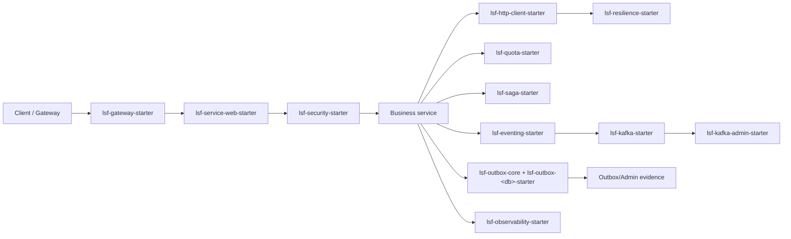

# LSF - Large Scale Framework

> Framework Java/Spring Boot dạng multi-module, được xây dựng để chuẩn hóa các phần hạ tầng thường lặp lại trong hệ thống microservices: Kafka/eventing, outbox, quota/reservation, saga orchestration, sync HTTP, security, discovery, resilience và observability.

LSF là framework phục vụ đồ án/luận văn và được kiểm chứng một phần qua hệ thống ecommerce consumer nằm ở repo `ecommerce-backend` trong cùng workspace. Ecommerce chỉ là case study để chứng minh khả năng áp dụng; các module của LSF có thể dùng cho nhiều hệ microservices khác có nhu cầu eventing, reliable publishing, quota/reservation, workflow và observability. Dự án này không cố thay thế toàn bộ Spring Cloud, Kubernetes hay các nền tảng vận hành production; mục tiêu chính là gom các pattern hạ tầng có thể tái sử dụng để service mới tập trung nhiều hơn vào business logic.

> **Lưu ý về mức trưởng thành:** Không phải tất cả module đều có cùng mức độ hoàn thiện. Các module được kiểm chứng rõ nhất qua consumer hiện tại là Kafka/eventing, observability, outbox MySQL, quota/reservation và saga checkout. Một số module khác đang ở mức starter/baseline; nên đọc thêm [docs/MODULE_MATURITY.md](docs/MODULE_MATURITY.md) trước khi áp dụng cho hệ thống thật.

## Đọc nhanh

| Mục tiêu đọc | Nên đọc |
|---|---|
| Hiểu LSF là gì và dùng cho ai | Phần giới thiệu, [Dành cho ai?](#dành-cho-ai), [Kiến trúc tổng quan](#kiến-trúc-tổng-quan) |
| Chọn module phù hợp | [Chọn module theo nhu cầu](#chọn-module-theo-nhu-cầu), [Module trong repository](#module-trong-repository) |
| Cài đặt và chạy source | [Cài đặt và chạy](#cài-đặt-và-chạy), [Database, migration và seed](#database-migration-và-seed) |
| Demo hoặc bảo vệ luận văn | [Kiểm chứng qua consumer](#kiểm-chứng-qua-consumer), [Trạng thái hoàn thành](#trạng-thái-hoàn-thành) |
| Phát triển hoặc mở rộng framework | [Cấu trúc thư mục](#cấu-trúc-thư-mục), [Dùng LSF trong service khác](#dùng-lsf-trong-service-khác), [Lỗi phổ biến khi chạy và cách sửa](#lỗi-phổ-biến-khi-chạy-và-cách-sửa) |

## Dành cho ai?

- Sinh viên hoặc nhóm phát triển muốn nghiên cứu microservices hướng sự kiện bằng Java/Spring Boot.
- Developer cần một bộ starter dùng lại cho Kafka, outbox, quota, event handler, tracing và REST nội bộ.
- Team muốn áp dụng dần các building block hạ tầng của LSF vào hệ thống microservices sẵn có hoặc service mới.

## Công nghệ chính

| Nhóm | Công nghệ |
|---|---|
| Ngôn ngữ | Java 21 |
| Framework | Spring Boot 3.5.7, Spring Cloud 2025.0.0 |
| Messaging | Apache Kafka, Confluent Schema Registry |
| Database/runtime | MySQL, PostgreSQL, Redis |
| Reliability | Outbox pattern, Resilience4j, retry/DLQ |
| Observability | Spring Actuator, Micrometer, Prometheus, Zipkin |
| Build/test | Maven, JUnit, Testcontainers, Flyway |

## Chọn module theo nhu cầu

| Nhu cầu | Module nên dùng |
|---|---|
| Publish/consume Kafka event | `lsf-kafka-starter`, `lsf-eventing-starter` |
| Chuẩn hóa event contract | `lsf-contracts` |
| Publish event đáng tin cậy sau DB transaction | `lsf-outbox-core`, `lsf-outbox-mysql-starter`, `lsf-outbox-postgres-starter` |
| Chống oversell/giữ tài nguyên tạm thời | `lsf-quota-starter` |
| Điều phối workflow nhiều bước | `lsf-saga-starter` |
| Quan sát metric/tracing/log context | `lsf-observability-starter` |
| Gọi REST nội bộ có retry/timeout | `lsf-http-client-starter`, `lsf-resilience-starter` |
| Tạo service mới theo mẫu | `lsf-service-template` |

## Module trong repository

| Module | Vai trò | Khi nào dùng? | README |
|---|---|---|---|
| `lsf-contracts` | Shared contracts như `EventEnvelope`, headers, request/trace context, quota commands và `LsfErrorResponse` | Khi nhiều service cần thống nhất contract | [README](lsf-contracts/README.md) |
| `lsf-kafka-starter` | Kafka producer/consumer defaults, retry, DLQ, serializer/deserializer baseline | Service publish/consume Kafka | [README](lsf-kafka-starter/README.md) |
| `lsf-eventing-starter` | Handler registry, `@LsfEventHandler`, envelope listener, publisher API và idempotency | Service muốn xử lý event theo handler thay vì tự route trong listener | [README](lsf-eventing-starter/README.md) |
| `lsf-observability-starter` | MDC, metrics và observation wrapper quanh dispatcher | Service cần theo dõi async event handling | [README](lsf-observability-starter/README.md) |
| `lsf-outbox-core` | Abstraction chung cho outbox writer và SQL helper | Module nền cho runtime outbox | [README](lsf-outbox-core/README.md) |
| `lsf-outbox-mysql-starter` | Runtime outbox cho MySQL | Service dùng MySQL cần publish event sau DB transaction | [README](lsf-outbox-mysql-starter/README.md) |
| `lsf-outbox-postgres-starter` | Runtime outbox cho PostgreSQL | Service dùng PostgreSQL cần outbox | [README](lsf-outbox-postgres-starter/README.md) |
| `lsf-outbox-admin-starter` | REST API để list, inspect, requeue, mark failed, delete outbox rows | Internal admin/ops tool cho outbox | [README](lsf-outbox-admin-starter/README.md) |
| `lsf-kafka-admin-starter` | REST API inspect/replay Kafka DLQ records | Khi cần bằng chứng vận hành và replay DLQ có kiểm soát | [README](lsf-kafka-admin-starter/README.md) |
| `lsf-quota-starter` | Reserve/confirm/release cho tài nguyên hữu hạn, có memory/Redis state và policy provider | Inventory hold, booking slot, flash sale, coupon quota | [README](lsf-quota-starter/README.md) |
| `lsf-saga-starter` | Saga orchestration tuần tự theo event, timeout, compensation và JDBC/in-memory store | Workflow nhiều bước cần điều phối có kiểm soát | [README](lsf-saga-starter/README.md) |
| `lsf-service-web-starter` | Servlet ingress conventions: request context filter và error response chuẩn | REST service nội bộ cần chuẩn hóa header/error | [README](lsf-service-web-starter/README.md) |
| `lsf-http-client-starter` | Declarative HTTP client trên `RestClient`, discovery, resilience và auth propagation | Service gọi REST tới service khác | [README](lsf-http-client-starter/README.md) |
| `lsf-config-starter` | Convention cho config import local/config server | Service cần bootstrap cấu hình tập trung | [README](lsf-config-starter/README.md) |
| `lsf-discovery-starter` | `LsfServiceLocator`, static discovery và bridge tới Spring `DiscoveryClient` | Local/dev/test discovery hoặc abstraction cho HTTP client | [README](lsf-discovery-starter/README.md) |
| `lsf-gateway-starter` | Spring Cloud Gateway conventions và correlation headers | Gateway muốn khai báo route theo convention LSF | [README](lsf-gateway-starter/README.md) |
| `lsf-security-starter` | API key/JWT security baseline cho servlet service | Internal APIs hoặc admin endpoints cần bảo vệ nhanh | [README](lsf-security-starter/README.md) |
| `lsf-resilience-starter` | Executor và policy resolver cho retry, circuit breaker, timeout, rate limit | Gọi downstream có rủi ro lỗi tạm thời | [README](lsf-resilience-starter/README.md) |
| `lsf-service-template` | Service scaffold dùng các starter LSF | Bắt đầu service mới theo chuẩn framework | [README](lsf-service-template/README.md) |
| `lsf-example` | Demo application cho eventing, outbox, quota và flash-sale flow | Học nhanh cách các module phối hợp | [README](lsf-example/README.md) |

## Kiến trúc tổng quan



```text
Client / Gateway
  -> lsf-gateway-starter
  -> lsf-service-web-starter + lsf-security-starter
      -> business service
      -> lsf-http-client-starter + lsf-discovery-starter + lsf-resilience-starter
      -> lsf-quota-starter
      -> lsf-saga-starter
      -> lsf-eventing-starter + lsf-kafka-starter
      -> lsf-outbox-core + lsf-outbox-<db>-starter

Operations
  -> lsf-observability-starter
  -> lsf-outbox-admin-starter
  -> lsf-kafka-admin-starter
```

Một service không cần dùng tất cả module. Ví dụ:

- Service chỉ publish/consume event: `lsf-contracts`, `lsf-kafka-starter`, tùy chọn `lsf-eventing-starter`.
- Service cần chống oversell: thêm `lsf-quota-starter`.
- Service cần publish event chắc chắn sau transaction: thêm `lsf-outbox-core` và một runtime outbox.
- Service cần REST nội bộ: dùng `lsf-service-web-starter`, `lsf-http-client-starter`, `lsf-discovery-starter`, `lsf-resilience-starter`.

## Kiểm chứng qua consumer

Repository này chỉ chứa framework và các starter tái sử dụng, nên không đặt ảnh kịch bản nghiệp vụ trực tiếp trong README của LSF. Các ảnh minh họa checkout flow, saga console, reservation chống oversell, outbox và JMeter được đặt ở README của consumer `ecommerce-backend`, vì đó là nơi thể hiện LSF khi áp dụng vào một hệ thống chạy thật.

## Cấu trúc thư mục

```text
lsf-parent/
├─ docs/                         # Tài liệu kiến trúc, adoption, compatibility, maturity
├─ ops/                          # Baseline monitoring/deployment
├─ lsf-*-starter/                # Các Spring Boot starter của framework
├─ lsf-contracts/                # Shared contract module
├─ lsf-outbox-core/              # Core outbox abstraction
├─ lsf-service-template/         # Scaffold service mới
├─ lsf-example/                  # Demo application
├─ docker-compose.yml            # Infra/demo baseline
└─ pom.xml                       # Maven parent và dependency management
```

## Cài đặt và chạy

### Yêu cầu

- JDK 21
- Maven 3.9+
- Docker Desktop nếu chạy Testcontainers, Kafka, Redis, MySQL hoặc demo compose

Kiểm tra Java:

```bash
mvn -version
```

Dòng `Java version` cần là `21.x`; repo có Maven Enforcer để fail fast nếu dùng sai JDK.

### Build và verify toàn bộ framework

```bash
cd <workspace>/lsf-parent
mvn clean verify
```

### Cài framework vào local Maven repository

Lệnh này cần chạy trước khi `ecommerce-backend` consume `1.0-SNAPSHOT`:

```bash
mvn clean install
```

### Build nhanh bỏ qua test

```bash
mvn clean install -DskipTests
```

### Chạy một module cụ thể

```bash
mvn -pl lsf-example spring-boot:run
```

### Chạy hạ tầng demo bằng Docker Compose

```bash
docker compose up -d kafka schema-registry mysql redis zipkin
```

Nếu muốn chạy cả app demo theo profile compose:

```bash
docker compose --profile apps up --build
```

## Dùng LSF trong service khác

Import BOM từ parent POM:

```xml
<dependencyManagement>
  <dependencies>
    <dependency>
      <groupId>com.myorg.lsf</groupId>
      <artifactId>lsf-parent</artifactId>
      <version>${lsf.version}</version>
      <type>pom</type>
      <scope>import</scope>
    </dependency>
  </dependencies>
</dependencyManagement>
```

Thêm starter cần dùng:

```xml
<dependency>
  <groupId>com.myorg.lsf</groupId>
  <artifactId>lsf-kafka-starter</artifactId>
</dependency>
```

Ví dụ cấu hình Kafka + eventing:

```yaml
lsf:
  kafka:
    bootstrap-servers: localhost:9092
    schema-registry-url: http://localhost:8081
    consumer:
      group-id: order-service
      batch: false
      retry:
        attempts: 3
        backoff: 200ms
    dlq:
      enabled: true
  eventing:
    producer-name: order-service
    consume-topics:
      - order-status-envelope-topic
    idempotency:
      enabled: true
      store: memory
```

Ví dụ outbox:

```yaml
lsf:
  outbox:
    enabled: true
    table: lsf_outbox
    publisher:
      enabled: true
      scheduling-enabled: true
      batch-size: 50
      poll-interval: 1s
      claim-strategy: SKIP_LOCKED
```

Ví dụ quota:

```yaml
lsf:
  quota:
    enabled: true
    store: REDIS
    default-hold-seconds: 30
    keep-alive-seconds: 86400
```

## Database, migration và seed

- LSF framework không sở hữu database business của consumer.
- Runtime outbox có SQL schema trong classpath của các module runtime DB.
- Consumer nên quản lý Flyway versioning của chính nó, ví dụ `ecommerce-backend/order-service/src/main/resources/db/migration`.
- `lsf-example` có profile minh họa MySQL outbox và Redis quota để chạy demo local.

## Tài liệu đọc thêm

Nên đọc trước:

- [docs/ARCHITECTURE.md](docs/ARCHITECTURE.md): kiến trúc tổng thể.
- [docs/PLATFORM_ADOPTION.md](docs/PLATFORM_ADOPTION.md): contract khi adopter dùng framework.
- [docs/MODULE_MATURITY.md](docs/MODULE_MATURITY.md): mức trưởng thành từng module.
- [docs/GOLDEN_PATHS.md](docs/GOLDEN_PATHS.md): các đường áp dụng khuyến nghị.

Chỉ cần mở khi nâng cấp hoặc chuẩn bị phát hành:

- [docs/COMPATIBILITY.md](docs/COMPATIBILITY.md): compatibility với consumer.
- [docs/UPGRADING.md](docs/UPGRADING.md): hướng dẫn nâng cấp.
- [docs/RELEASE_POLICY.md](docs/RELEASE_POLICY.md): chính sách release/deprecation.

## Lỗi phổ biến khi chạy và cách sửa

| Lỗi | Nguyên nhân thường gặp | Cách sửa |
|---|---|---|
| `LSF framework must be built with JDK 21` | Maven đang chạy bằng JDK khác 21 | Kiểm tra `mvn -version`, đổi `JAVA_HOME` sang JDK 21 rồi chạy lại |
| Không resolve được dependency Confluent | Maven chưa đọc repository `https://packages.confluent.io/maven/` hoặc mạng/proxy chặn | Kiểm tra mạng, proxy Maven, rồi chạy `mvn -U clean install` |
| Testcontainers fail hoặc treo khi chạy test | Docker Desktop chưa chạy hoặc không đủ quyền truy cập Docker daemon | Mở Docker Desktop, kiểm tra `docker ps`, sau đó chạy lại test |
| `ecommerce-backend` không tìm thấy `com.myorg.lsf:*:1.0-SNAPSHOT` | Framework chưa được install vào local Maven repo | Chạy `mvn clean install` trong `<workspace>/lsf-parent` trước |
| `docker compose` báo port đã được dùng | Kafka/MySQL/Redis/Zipkin hoặc service cũ đang chiếm port | Dừng container/process cũ bằng Docker Desktop hoặc đổi port trong compose |
| `lsf-example` không kết nối được Kafka/Redis/MySQL | Hạ tầng demo chưa chạy hoặc profile chưa đúng | Chạy `docker compose up -d kafka schema-registry mysql redis zipkin`, rồi chạy app với profile phù hợp |

## Trạng thái hoàn thành

| Nhóm | Trạng thái |
|---|---|
| Kafka/eventing/observability | Đã có starter, focused tests và một số cross-module runtime tests |
| Outbox MySQL | Đã được dùng trong consumer ecommerce, có migration/runtime evidence |
| Outbox PostgreSQL | Có runtime module và test, mức consumer evidence thấp hơn MySQL |
| Quota/reservation | Được áp dụng rõ trong `inventory-service` của ecommerce consumer |
| Saga | Có runtime hữu ích cho flow tuần tự và demo default-on trong consumer, vẫn nên xem là partial support |
| Gateway/config/discovery/security/resilience/sync HTTP | Starter-level support, phù hợp làm baseline hơn là platform hoàn chỉnh |

## Lưu ý quan trọng

- Không phải mọi module đều production-ready ở cùng mức. Xem thêm [docs/MODULE_MATURITY.md](docs/MODULE_MATURITY.md).
- Một số test dùng Docker/Testcontainers hoặc broker/database thật, nên cần hạ tầng local phù hợp.
- Consumer dùng `1.0-SNAPSHOT` cần chạy `mvn clean install` ở repo này trước.
- Không nên expose admin endpoints như outbox/kafka admin ra internet công khai.

## Tác giả

- **Tên:** Nguyễn Lâm Trường
- **Email:** lamtruongnguyen2004@gmail.com
- **GitHub:** [https://github.com/truongnguyen3006](https://github.com/truongnguyen3006)
